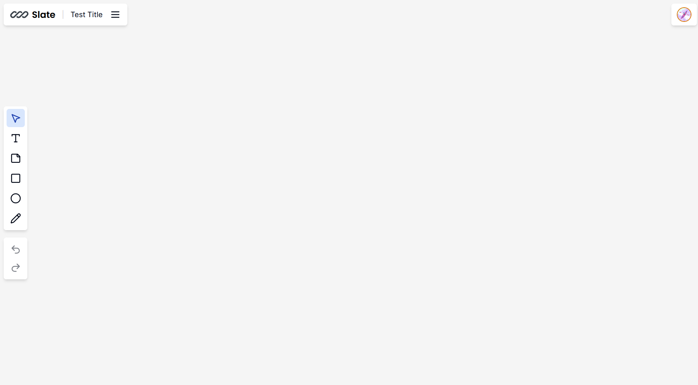

# Slate

[](https://opensource.org/license/MIT)


## Table of Contents

- [Description](#description)
- [Deployed Website Link](#deployed-website-link)
- [Installation](#installation)
- [GitHub](#github)
- [Contact](#contact)
- [License](#license)

## Description

Slate is a collaborative whiteboard application designed to enhance productivity and teamwork. With features that allow real-time collaboration and cursor presence, Slate is perfect for organizations looking to streamline their creative and planning processes.

### Motivation

The motivation behind Slate was to create a seamless and interactive platform for teams to collaborate effectively, regardless of their physical locations. In today's fast-paced and often remote working environments, having a tool that facilitates real-time collaboration is essential.

### Why Build Slate?

Slate was built to provide an intuitive and user-friendly interface where team members can work together on projects in real-time. It aims to bridge the gap between remote and in-office team members, ensuring that everyone can contribute and stay on the same page.

### Problem Solved

Slate addresses the need for a dynamic and interactive space where teams can brainstorm, plan, and execute their ideas collaboratively. It solves the problem of disjointed communication and inefficient collaboration by providing a platform that supports real-time interactions and visual representation of ideas.

### Learning Outcomes

Building Slate was a significant learning experience in understanding the complexities of real-time communication and collaboration technologies.

## Deployed Website Link

Deployed website: [https://slate-mocha-nine.vercel.app](https://slate-mocha-nine.vercel.app)

<p align="center">
  <br>
  Whiteboard Canvas Demo
</p>

## Installation

### Prerequisites

- Node.js
- npm or yarn

## Installation

1. **Clone the repository:**

   ```bash
   git clone https://github.com/ethan05d/slate.git
   cd slate
   ```

2. **Install dependencies:**

   `npm install`
   or
   `yarn install`

3. Create a .env file in the root directory and add any necessary environment variables.

4. Start the development server:

   `npm run dev`

   or

   `yarn dev`

5. Open your browser and navigate to http://localhost:3000.

## GitHub

<a href="https://github.com/ethan05d"><strong>ethan05d</a></strong>

## Contact

Feel free to reach out to me on my email:
ethan05dy@gmail.com

## License

[](https://opensource.org/license/MIT)
